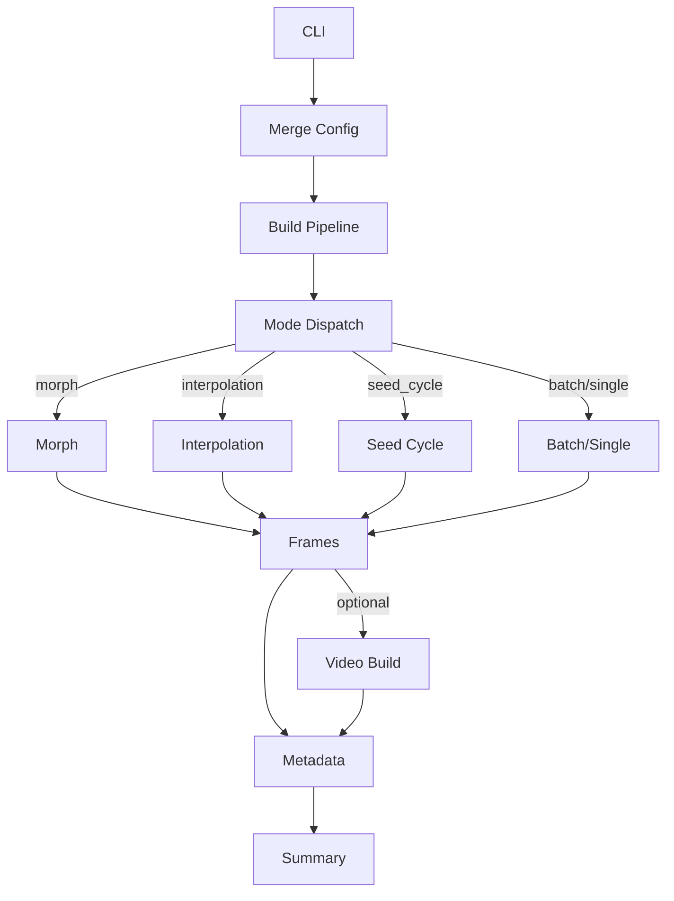
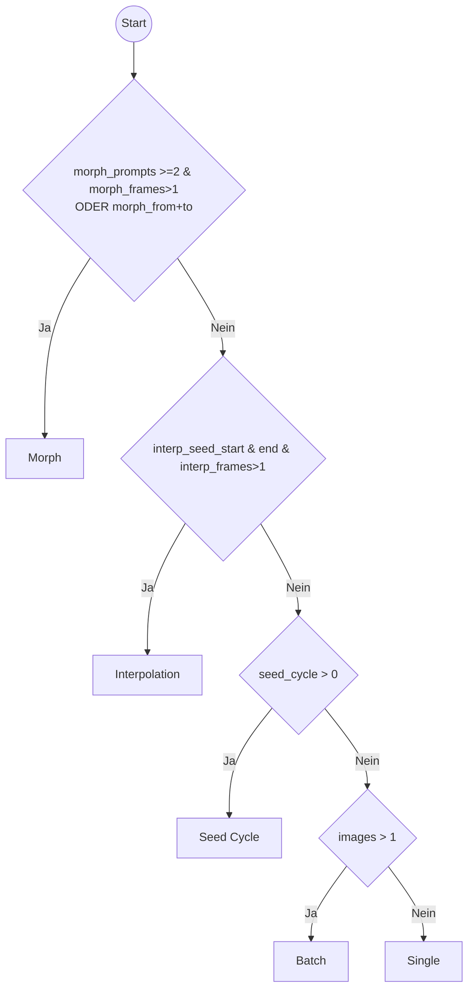
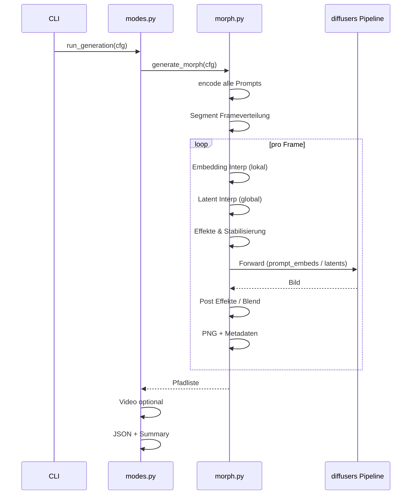
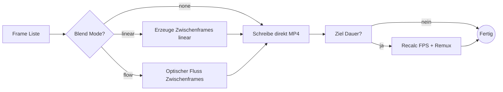

# Architektur & Ablauf (SDGen)

Diese Datei beschreibt Aufbau, Komponenten und Programmfluss des Tools. Enthält Mermaid‑Diagramme für schnellen Überblick.

## 1. Überblick

Zentrale CLI: `generate.py` → baut aus Flags oder JSON (`--config`) eine `GenerationConfig` → Pipeline (diffusers) → Modus‑Dispatcher (`sdgen/modes.py`) → Spezifische Generatoren (morph / interpolation / seed_cycle / single|batch) → Optional Video → Metadaten & Zusammenfassungen.

## 2. Hauptkomponenten

| Komponente | Datei | Aufgabe | Wichtige Notizen |
|------------|-------|---------|------------------|
| CLI / Entry | `generate.py` | Argumente + Config Merge + Start | Überschreibt nur explizit gesetzte Flags |
| Konfiguration | `sdgen/config.py` | `GenerationConfig` Dataclass | Enthält alle Parameter / Flags |
| Modus Dispatcher | `sdgen/modes.py` | Moduswahl + Ausführung + Video + Metadaten | Priorität: morph > interpolation > seed_cycle > batch > single |
| Morph Engine | `sdgen/morph.py` | Multi‑Prompt Embedding & (optional) Latent Morph + Effekte | Mehrsegment-Verteilung + Effekte + Stabilisierung |
| Interpolation | `sdgen/interpolate.py` | Latent Seed→Seed Interpolation | Linear oder Slerp |
| Seed Cycle | `sdgen/seedcycle.py` | Fortlaufende Seed Variation | Optional Latent Jitter |
| Video Builder | `sdgen/video.py` | MP4 Bau + Blend Frames | Dynamische FPS bei Ziel-Dauer |
| Utilities | `sdgen/utils.py` | Run ID, Sanitizing, PNG & JSON Metadaten | PNG Text-Chunks + Summary |
| Pipeline Wrapper | `sdgen/pipeline.py` | Laden & Default Heuristiken | Steps/Guidance Defaults je Modell |

## 3. Vollständige Konfiguration

Alle Felder der `GenerationConfig` inkl. Default, Typ, zugehörigem CLI Flag (falls vorhanden) und Bedeutung.

### 3.1 Basis

| Feld | CLI Flag | Typ | Default | Beschreibung |
|------|----------|-----|---------|--------------|
| prompt | `--prompt` | str | (erforderlich*) | Texteingabe (oder über Morph Parameter ersetzbar) |
| negative | `--negative` | str | "" | Negativer Prompt |
| model | `--model` | str | stabilityai/sd-turbo | Hugging Face Modell-ID |
| height | `--height` | int | 512 | Bildhöhe (Vielfache von 8) |
| width | `--width` | int | 512 | Bildbreite (Vielfache von 8) |
| steps | `--steps` | Optional[int] | None | Sampler Schritte (None = heuristisch / Modellabhängig) |
| guidance | `--guidance` | Optional[float] | None | CFG Guidance (Turbo oft 0.0) |
| images | `--images` | int | 1 | Anzahl Einzelbilder (Batch) |
| seed | `--seed` | Optional[int] | None | Fester Start-Seed |
| outdir | `--outdir` | str | outputs | Ausgabeverzeichnis Basis |
| half | `--half` | bool | False | FP16 Aktivierung (VRAM/Speed) |

(* Erforderlich falls nicht Morph / Info Only.)

### 3.2 Video

| Feld | CLI Flag | Typ | Default | Beschreibung |
|------|----------|-----|---------|--------------|
| video | `--video` | bool | False | MP4 erzeugen |
| video_name | `--video-name` | Optional[str] | None | Custom Dateiname (sonst run_id.mp4) |
| video_frames | `--video-frames` | int | 0 | Erzwingt Mindestzahl Frames (Auffüllung) |
| video_fps | `--video-fps` | int | 0 | Fixe FPS (0 = dynamisch) |
| video_blend_mode | `--video-blend-mode` | str | none | Blend Mode (none / linear / flow) |
| video_blend_steps | `--video-blend-steps` | int | 0 | Zwischenframes pro Übergang |
| video_target_duration | `--video-target-duration` | float | 0.0 | Ziel-Länge (fps auto) |

### 3.3 Latent Interpolation

| Feld | CLI Flag | Typ | Default | Beschreibung |
|------|----------|-----|---------|--------------|
| interp_seed_start | `--interp-seed-start` | Optional[int] | None | Start Seed |
| interp_seed_end | `--interp-seed-end` | Optional[int] | None | End Seed |
| interp_frames | `--interp-frames` | int | 0 | Anzahl interpolierter Schritte |
| interp_slerp | `--interp-slerp` | bool | False | Slerp statt linear |

### 3.4 Seed Cycling

| Feld | CLI Flag | Typ | Default | Beschreibung |
|------|----------|-----|---------|--------------|
| seed_cycle | `--seed-cycle` | int | 0 | Anzahl aufeinanderfolgender Seeds |
| seed_step | `--seed-step` | int | 997 | Inkrement pro Cycle |
| latent_jitter | `--latent-jitter` | float | 0.0 | Additives Rausch-Jitter pro Bild |

### 3.5 Morph (Struktur)

| Feld | CLI Flag | Typ | Default | Beschreibung |
|------|----------|-----|---------|--------------|
| morph_from | `--morph-from` | Optional[str] | None | Start-Prompt (2-Punkt) |
| morph_to | `--morph-to` | Optional[str] | None | Ziel-Prompt (2-Punkt) |
| morph_prompts | `--morph-prompts` | Optional[List[str]] | None | Kommagetrennte Liste für Multi-Stage |
| morph_frames | `--morph-frames` | int | 0 | Gesamtframes Morph |
| morph_seed_start | `--morph-seed-start` | Optional[int] | None | Seed A für Latent Morph |
| morph_seed_end | `--morph-seed-end` | Optional[int] | None | Seed B für Latent Morph |
| morph_latent | `--morph-latent` | bool | False | Latent Interp aktivieren |
| morph_slerp | `--morph-slerp` | bool | False | Slerp für Latent |

### 3.6 Morph Effekte / Stabilisierung

| Feld | CLI Flag | Typ | Default | Beschreibung |
|------|----------|-----|---------|--------------|
| morph_ease | `--morph-ease` | str | linear | Easing Kurve (linear/ease/ease-in/ease-out/sine/quad/cubic) |
| morph_color_shift | `--morph-color-shift` | bool | False | Farbkanal Rotation aktiv |
| morph_color_intensity | `--morph-color-intensity` | float | 0.25 | Stärke Farbshift |
| morph_noise_pulse | `--morph-noise-pulse` | float | 0.0 | Sinus Noise Amplitude |
| morph_frame_perturb | `--morph-frame-perturb` | float | 0.0 | Pixelraum Warp Intensität |
| morph_temporal_blend | `--morph-temporal-blend` | float | 0.0 | Mischung mit Vorframe (Stabilität) |
| morph_effect_curve | `--morph-effect-curve` | str | center | Verteilung Effektintensität |
| morph_smooth | `--morph-smooth` | bool | False | Mildes Smoothing nach Effekten |

### 3.7 Offload / Performance

| Feld | CLI Flag | Typ | Default | Beschreibung |
|------|----------|-----|---------|--------------|
| cpu_offload | `--cpu-offload` | bool | False | Diffusers offload (geringer VRAM) |
| seq_offload | `--seq-offload` | bool | False | Sequentielles Offload (minimal; langsam) |
| no_slicing | `--no-slicing` | bool | False | Attention Slicing deaktivieren |
| info_only | `--info` | bool | False | Nur Pipeline Info anzeigen |

### 3.8 Run Verwaltung / Metadaten

| Feld | CLI Flag | Typ | Default | Beschreibung |
|------|----------|-----|---------|--------------|
| make_run_dir | (intern) | bool | True | Ordner pro Run erzeugen |
| run_id | (intern / generiert) | Optional[str] | None | Eindeutige Kennung |
| run_dir | (intern) | Optional[str] | None | Vollständiger Pfad zum Run |
| write_meta | (kein Flag) | bool | True | PNG + JSON Metadaten schreiben |
| mode | (intern) | str | single | Ermittelter Modus |

### 3.9 Flag Override Logik

Nur explizit übergebene CLI Flags überschreiben Werte aus `--config`. Nicht gesetzte Flags lassen Config-Datei-Werte unberührt (verhindert versehentliches Nullsetzen z.B. bei `morph_frames`).

Erkennung erfolgt über Vorhandensein des Tokens im `sys.argv` Set.

### 3.10 Erforderliche Mindestkombinationen

| Ziel | Minimale Parameter |
|------|-------------------|
| Single Bild | `--prompt` |
| Batch | `--prompt --images >1` |
| Morph 2-Punkt | `--morph-from --morph-to --morph-frames >1 --prompt placeholder` |
| Morph Multi | `--morph-prompts "a,b,..." --morph-frames >1` |
| Interpolation | `--interp-seed-start --interp-seed-end --interp-frames >1 --prompt` |
| Seed Cycle | `--seed-cycle >0 --prompt` |
| Video | Beliebiger Modus + `--video` (oder Frames>1 & Flag) |

`--prompt placeholder` wird bei Morph genutzt, wenn inhaltlich der eigentliche Prompt durch Embedding-Interpolation ersetzt wird.

## 4. High-Level Datenfluss

## 5. Modus Auswahl Logik

## 6. Morph Segment Ablauf

## 7. Video Build (vereinfacht)

Hinweis: Wenn "ja" (Ziel Dauer gesetzt & keine feste fps), wird fps neu berechnet (ursprünglich: "Ja (fps 0 gesetzt)").

## 8. Timing & Zusammenfassung

`modes.run_generation` misst Gesamtzeit → schreibt:
 
* `runtime_seconds`
* `avg_seconds_per_image`
* `<run_id>-summary.md` mit Tabelle + Roh-Konfig.

## 9. Erweiterbare Punkte

| Bereich | Erweiterungsidee |
|---------|------------------|
| Video | GIF/WebM, Ping-Pong Loop |
| Morph | Segmentweise Latent-Slerp, adaptive Effekte |
| Logging | Optionales Verbose/JSON Logging |
| Config | YAML Support / env Overrides |
| Performance | xFormers / Flash Attention Einbindung |

## 10. Wartung / Update Hinweise

Bei neuen Flags: 1) `GenerationConfig` ergänzen 2) CLI Mapping 3) Metadata + Summary falls relevant 4) README & ARCHITEKTUR.md aktualisieren.

---

Letzte Aktualisierung: (automatisch nicht gesetzt – bitte bei strukturellen Änderungen pflegen)
