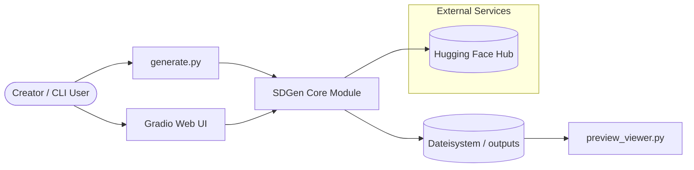
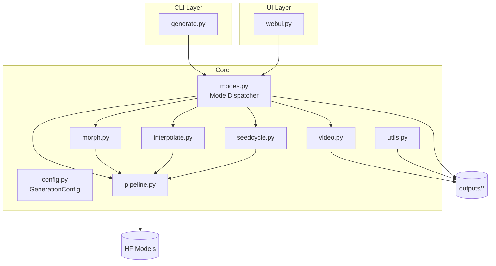
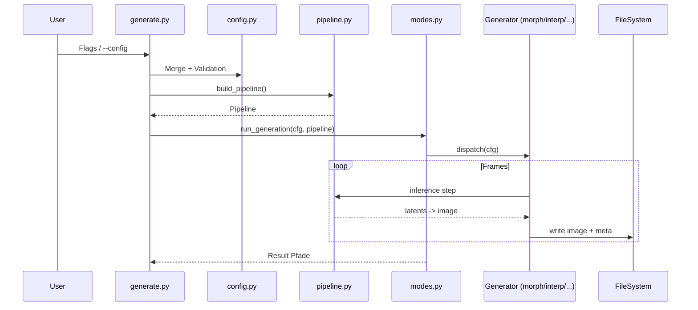
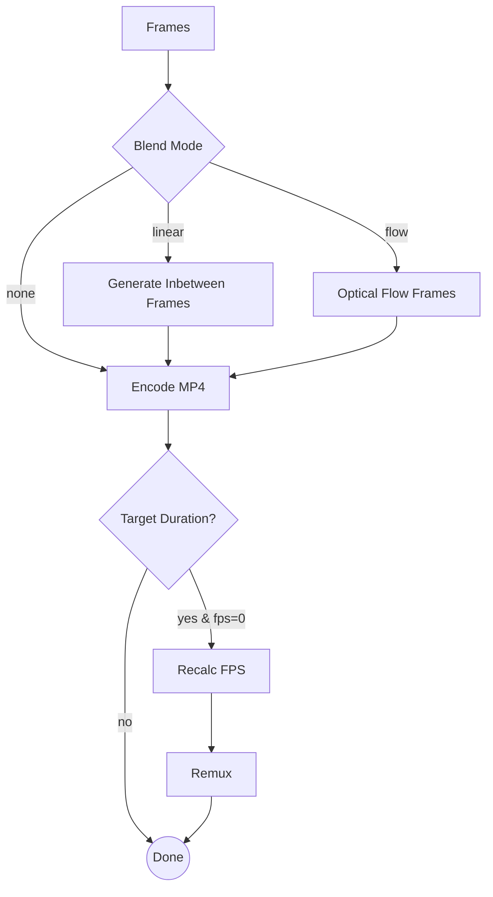
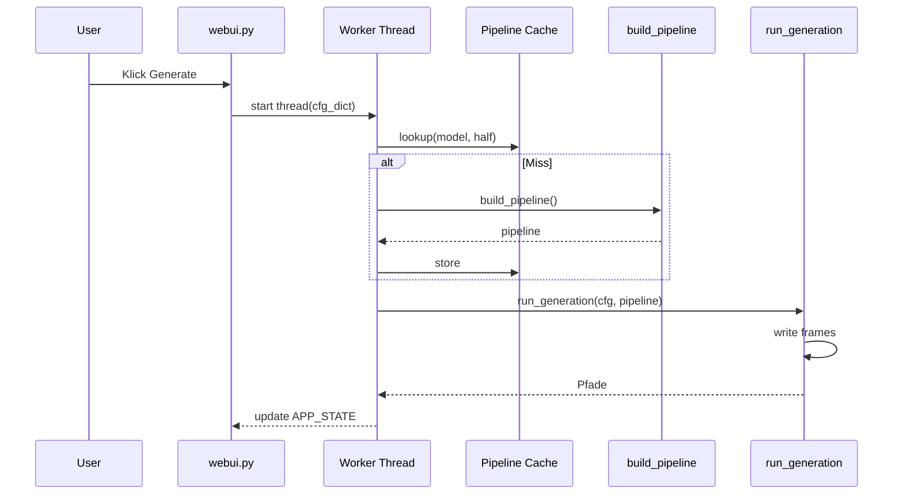
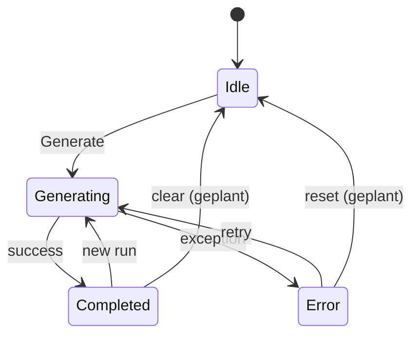
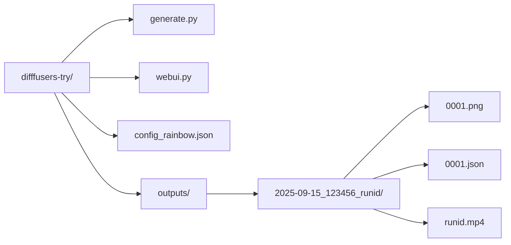
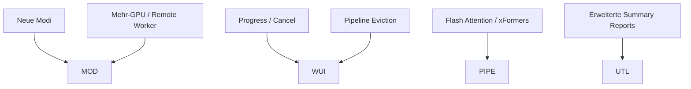

# Architektur Diagramme (Ergänzung)

Diese Datei ergänzt `ARCHITEKTUR.md` und `WEBUI.md` um zusätzliche fokussierte Visualisierungen (C4-inspiriert).

## 1. System Context



## 2. Container / Komponenten Überblick



## 3. Datenfluss Konfiguration → Bilder



## 4. Morph Detail (Embedding & Latent)

```mermaid
flowchart LR
  A[Prompts Liste] --> ENC[Text Encoder]
  ENC --> EMB[Prompt Embeddings]
  EMB -->|Frame t Auswahl + Easing| BLEND[Embedding Interpolation]
  BLEND --> UNet[UNet Denoising]
  subgraph Optional Latent Morph
    LAT0[Latent Seed A] --> LBLEND[Latent Interp (linear/slerp)]
    LAT1[Latent Seed B] --> LBLEND
  end
  LBLEND --> UNet
  UNet --> IMG[Frame PNG]
  IMG --> POST[Effekte / Temporal Blend]
  POST --> OUT[(Run Ordner)]
```

## 5. Video Build Pipeline



## 6. Threading in Web UI



## 7. Zustandsautomat (erweitert)



## 8. Dateistruktur (vereinfacht)



## 9. Erweiterungspunkte



---
Letzte Aktualisierung: 2025-09-15
