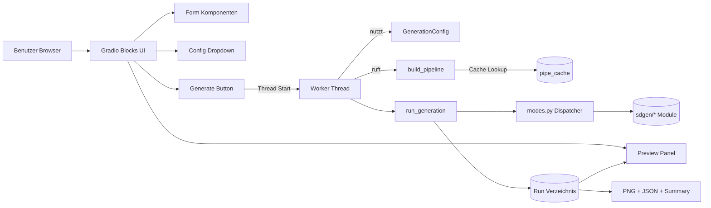
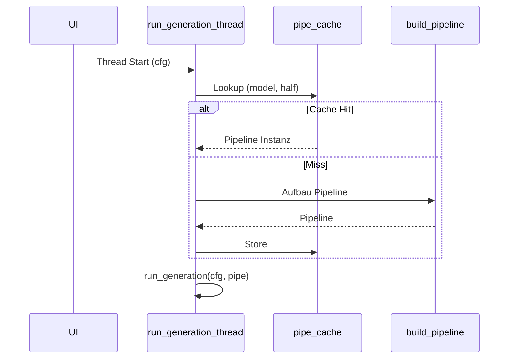
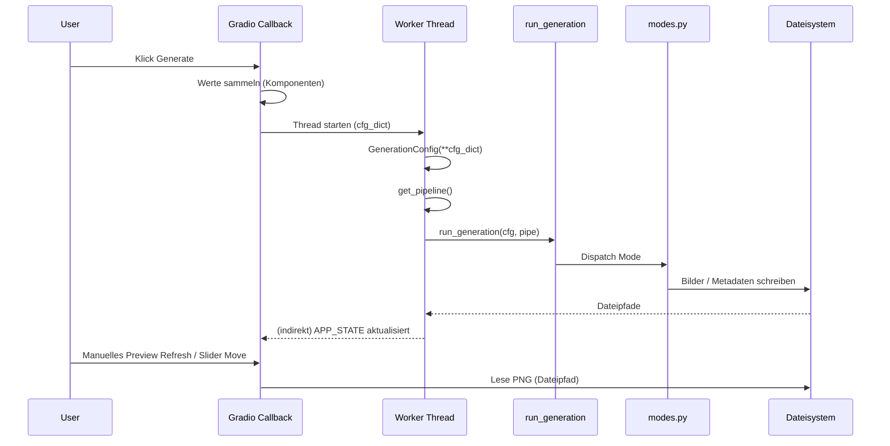
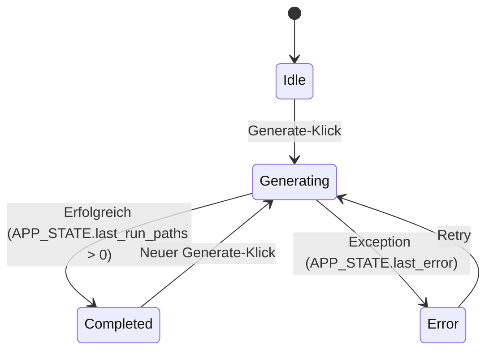
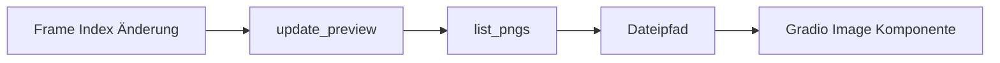

# Web UI Architektur & Dokumentation (SDGen)

Diese Datei beschreibt die spezifische Architektur der Gradio‐basierten Web UI (`webui.py`) für SDGen. Sie ergänzt `ARCHITEKTUR.md` mit Fokus auf:

* UI Layout & Komponentenaufbau
* Parameterabbildung (`PARAM_SPECS` → dynamische Formulare)
* State Handling (`APP_STATE`)
* Pipeline Caching & Resource Management
* Ereignisfluss von Interaktionen (Config laden, Generierung, Vorschau)
* Threading / Nebenläufigkeit
* Preview & (vorläufiges) Auto‑Play
* Fehlerpfade & Statuskommunikation
* Erweiterungsperspektiven

---

## 1. High‑Level Überblick



Die Web UI fungiert als dünne Interaktionsschicht über den bereits modularen CLI‑Kern. Es wird kein separater Server‑Controller eingeführt; Gradio ruft die Python Callbacks direkt auf.

---

## 2. Dateien & Rollen (UI‑spezifisch)

| Datei | Aufgabe |
|-------|---------|
| `webui.py` | Komplettes UI Layout + Callbacks + Pipeline Cache + Thread Start |
| `sdgen/config.py` | Definition `GenerationConfig` (wird aus UI Werten instanziiert) |
| `sdgen/pipeline.py` | Pipeline Laden (HF diffusers) + Heuristiken + Safety Warning Filter |
| `sdgen/modes.py` | Modus Selektion & Orchestrierung (unverändert genutzt) |
| `sdgen/morph.py` etc. | Spezifische Generatoren (unverändert) |

---

## 3. Parametererzeugung

`PARAM_SPECS` listet Felder als Tupel:

```text
(feldname, typ, min, max, step, kategorie)
```

Diese Spezifikation wird in `build_param_components()` iteriert → passende Gradio Komponente pro Feld:

* `Textbox` für Strings
* `Slider` für numerische Bereiche
* `Number` für optional befüllbare Ganzzahlen ohne Range (Seeds)
* `Checkbox` für boolsche Flags
* `Dropdown` für diskrete Choices (z.B. Blend Modes, Easing)

Mapping Besonderheit:

* Bools: Nur wenn `True` gesetzt → in Config dict geschrieben (gleichen CLI‑Semantik „Flag setzt True“, sonst Default in Dataclass).
* `morph_prompts`: Komma‐getrennte Liste im UI → Liste von Strings für `GenerationConfig`.

---

## 4. Interner State

```python
APP_STATE = {
  'pipe_cache': {},      # (model_id, half) -> Pipeline Objekt
  'last_run_paths': [],  # Liste generierter PNG Pfade
  'last_run_dir': None,  # Run Verzeichnis
  'autoplay': False,     # (derzeit nicht aktiv dynamisch verknüpft)
  'last_error': None,    # Optionaler Fehlertext
}
```

### Pipeline Cache Ablauf



---

## 5. Ereignisfluss „Generate“



Aktuell erfolgt keine Live Progress Anzeige; der Status TextBox zeigt lediglich „Running…“ und Endzustand erst nach Nutzerinteraktion (Preview Bewegung).

---

## 6. Konfigurationsladeprozess

```mermaid
flowchart TD
  A[Dropdown Auswahl] --> B{Pfad valide?}
  B -->|Nein| C[Leere Werte zurück]
  B -->|Ja| D[JSON laden]
  D --> E{morph_prompts Liste?}
  E -->|Ja| F[Join mit ", "]
  E -->|Nein| G[Unverändert]
  F --> H[Dict → Komponenten Updates]
  G --> H
```

---

## 7. Run Lifecycle (State Machine)



Der visuelle Zustand im UI wird (noch) nicht mit farblichen Indikatoren dargestellt; potentielle Erweiterung.

---

## 8. Vorschau / Preview Mechanik

* Nach Abschluss: PNGs liegen im `run_dir` (Dateinamensschema vom Kern).
* Slider `index_slider` wählt Bildindex → Callback `update_preview()`.
* Pfade werden mit `glob` + sort geladen (lexikographische Reihenfolge = chronologisch).
* Auto‑Play: Noch kein echtes Timer Event; Markup Hinweis erklärt Limitierung. (Gradio v4 bietet `gr.Timer` – nicht implementiert.)

### Vereinfachter Preview Flow



---

## 9. Fehlerbehandlung

* Exceptions im Worker Thread: Gefangen & `APP_STATE['last_error']` gesetzt.
* UI Status Feld erhält keinen automatischen Fehlertext (nur indirekt, wenn man erweitern würde → Polling nötig).
* TODO: Periodisches Polling / Event Streaming (siehe Erweiterungen).

---

## 10. Nebenläufigkeit & Threading

* Jede Generierung: Ein dedizierter `threading.Thread` (Daemon).
* Kein Cancel / Abort Mechanismus (Diffusers Sampler bricht nicht ab → potentielle Erweiterung: Flag + periodische Abfrage in Loops).
* Pipeline Cache ist nicht thread‑safe per Lock – akzeptabel, da UI typischerweise sequentielle Runs; bei parallelen Klicks riskante doppelte Pipeline‐Initialisierung (geringes Risiko, aber möglich).

### Verbesserungsvorschläge

| Bereich | Ansatz |
|---------|-------|
| Thread Safety | `threading.Lock` um Pipeline Cache Zugriffe |
| Progress | Shared Queue / Callback Streaming / Websocket |
| Cancel | Globales Flag + Einbau in per‐Frame Loop der Modi |
| Multi User | Separate Session Keys + isolierte Caches |

---

## 11. Performance & Ressourcen

* Gemeinsame Pipeline Wiederverwendung reduziert initiale Latenz (besonders Turbo Modelle).
* FP16 Option (half) reduziert VRAM.
* Kein aktives Unload / Release (CUDA Speicher bleibt belegt) – bei Modellwechsel wächst Footprint.

### Potenzielle Optimierungen

| Technik | Nutzen |
|---------|-------|
| Explicit `torch.cuda.empty_cache()` nach Run | Speicherfragmentierung mindern |
| Model Eviction LRU (max N Pipelines) | Speicherlimit erzwingen |
| Lazy Text Encoder Move | Schnellere Erstreaktion auf UI Klick |

---

## 12. Sicherheit / Stabilität

| Aspekt | Bewertung |
|--------|-----------|
| Pfadzugriff | Nur lokale JSON unter vordefinierten Verzeichnissen |
| Benutzerinput | Prompt Strings direkt weitergereicht → normale SD Nutzung |
| Code Execution | Keine dynamische Auswertung von Nutzereingaben |
| Denial of Service | Mehrfach schnelle Klicks können Threads stapeln |

Empfehlung: Button deaktivieren während Run (kann über Rückgabewert + JS/Gradio Props umgesetzt werden).

---

## 13. Erweiterungsideen (konkret UI)

| Kategorie | Idee | Kurzbeschreibung |
|-----------|------|------------------|
| Progress | Live ETA Anzeige (Polling Timer + Shared JSON) | Fortschritt / Restzeit im Statusfeld |
| Autoplay | `gr.Timer` Integration | Echte zyklische Preview Aktualisierung |
| Multi Run | Run Historie Liste | Auswahl früherer Sessions + Reload der Settings |
| Cancel | Abbruch Button | Setzt Flag; Loops prüfen Flag & brechen ab |
| Upload | Prompt Preset Import | JSON Upload → Komponenten füllen |
| Theming | Dark / Minimal Mode | Umschaltbare CSS Themes |
| Queue | Serialisierung | Warteschlange statt paralleler Threads |
| Logs | Live Log Stream | Tail on a ring buffer |
| Export | GIF / WebM direkt | UI Häkchen „Zusätzliche Formate“ |

---

## 14. Unterschiede zur CLI Nutzung

| Punkt | CLI | Web UI |
|-------|-----|--------|
| Konfiguration | Flags / JSON Merge | Interaktive Form + optional JSON Ladefunktion |
| Fortschritt | Terminal Prints + ETA | (Noch) kein Live Stream |
| Batch Automatisierung | Shell Skripte | Manuelle Interaktion |
| Erweiterbarkeit | Einfache Script Anbindung | UI Änderungen erfordern Layout Code |

---

## 15. Bekannte Limitierungen (Stand: Erstversion)

* Kein echtes Autoplay (nur Platzhalter Hinweis)
* Kein automatisches Status Refresh / kein Progress Streaming
* Kein Fehler Popup; Fehler nur intern abgelegt
* Keine Sperre des Generate Buttons während Run
* Kein Persist Layer für gespeicherte Preset Konfigurationen (nur externe JSON)

---

## 16. Changelog

| Datum | Änderung |
|-------|----------|
| 2025-09-11 | Erste Erstellung dieser Datei |

---

## 17. Kurzer Implementierungsfahrplan für nächste Schritte

1. Progress JSON Datei pro Run (laufend überschreiben) + Timer (`gr.Timer`) zum Polling.
2. `gr.Timer` (Intervall 500–800 ms) für Preview Autoplay & Status Aktualisierung.
3. Button Disable: `run_btn.click(..., js=...)` oder Rückgabewert → `interactive=False` setzen während Run.
4. Cancel Flag: Globales `APP_STATE['cancel']` + Abfrage in allen Frame Loops.
5. Pipeline Cache Lock + LRU (max 2–3 aktive Pipelines) zur VRAM Kontrolle.

---

## 18. Referenzen

* Diffusers Docs: <https://huggingface.co/docs/diffusers>
* Gradio Blocks: <https://www.gradio.app/guides/blocks-and-event-listeners>
* Mermaid Syntax: <https://mermaid.js.org/>

---

Falls diese Datei erweitert wird: Abschnitt „Changelog“ aktualisieren & ggf. Verlinkung in `README.md` pflegen.
